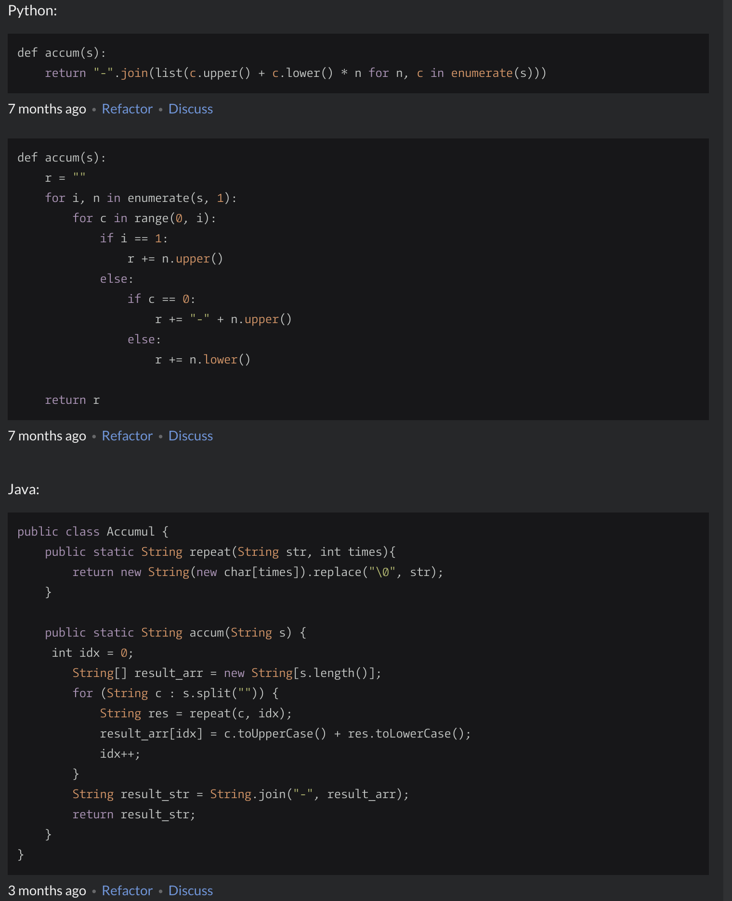

Python Study
=========

## Python 소개

1. http://tcpschool.com/python/intro_characteristic

2. 

3. 나무위키: https://namu.wiki/w/Python

4. Comprehension: https://mingrammer.com/introduce-comprehension-of-python/

5. 숙제
- Pycham
- Hello world
- Hello World

## Python Data Model
> 파이썬에서의 데이터 모델이란?
 
파이썬 공식문서에서의 데이터 모델은 아래 세개로 이루어 져 있다. 
- Object, Value, Type
- 표준형 계층
- 특수메서드 이름
- 코루틴

즉, 객체 (Objects)는 파이썬이 데이터(data)를 추상화한 것(abstraction)입이고 파이썬의 데이터 모델이라는 것은
파이썬이 객체를 어떻게 다룰 것인가에 대한 이야기.

이중 특수메서드에 대해서 살펴봄으로써 파이선스러움(pythonic)을 맛보기로 한다.
   
> 파이썬은 왜 collection.len()이 아닌 len(collection) 인가.

괴상함, pythonic, 던더함수(메직메서드, 특별메서드, 던더메서드)

len() -> __len__(), for i in x:

파이썬의 선(The Zen of Python, https://www.python.org/doc/humor/#the-zen-of-python)

'실용성이 순수성에 우선한다'

len()은 함수지 메서드가 아니다. __len__() 이 메서드지...

왜 특별 메서드가 있는거야? -> 사용자 정의 객체도 내장 객체처럼!

> 사용자 정의 객체도 내장 객체 처럼
```
class Calculator:
    a = [1, 2, 3, 4]

    def __len__(self):
        return len(self.a)

    def len(self):
        return len(self.a)

if __name__ == "__main__":
    cal = Calculator()
    print(cal.len())
    print(len(cal))
``
